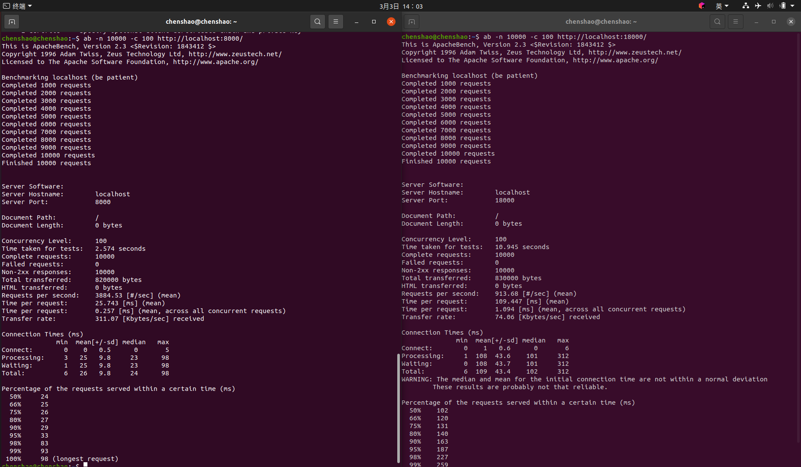

# mymuduo
## 介绍
这是一个我自己研究陈硕的muduo库源码（https://github.com/chenshuo/muduo）
而重写的自己的muduo库。
muduo源码依赖于boost库，而这个mymuduo采用C++11特性重写，脱离boost库。
muduo基于Reactor（或者说是multiple Reactors）模型，该模型有4个组件：Event事件，Reactor反应堆，Demultiplex事件分发器,EventHandler事件处理器。

## 安装方法
执行 sudo ./autobuild.sh

## 使用方法
如./example下的例子，编译时，执行make即可。

## 有待改进之处
apache压力测试的结果，mymuduo居然比muduo库性能更好？一定是某些bug导致的。
内部只有epoll的实现，没有select和poll的实现，保留了接口，有待实现。

